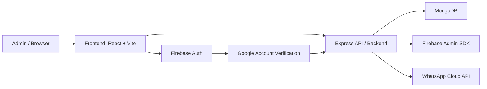

# Easy Tech Solution — Full Stack Client & Payment Management

## Project summary

This repository is a full-stack business dashboard for managing client entries, service progress, payment collection, admin login, and follow-up communication. It is designed for a small business workflow where a single admin can track all client work, deal values, cash flow, and WhatsApp updates from one place.

### Core stack
- Frontend: React + TypeScript + Vite + Tailwind CSS
- Backend: Node.js + Express + TypeScript
- Database: MongoDB + Mongoose
- Authentication: Firebase Google Sign-In + JWT + allowlisted admin emails
- Notifications: WhatsApp Cloud API

---

## Architecture diagram



### Data flow
1. Admin signs in with Google from the frontend.
2. Frontend sends the Firebase ID token to the backend.
3. Backend validates the token using Firebase Admin SDK.
4. Backend checks the admin email against the allowlist.
5. Backend issues a JWT and authorizes future API requests.
6. Entry and payment changes are stored in MongoDB.
7. WhatsApp updates are sent to the client if configured.

---

## Repository structure

```text
ets-fullstack/
├── backend/
│   ├── src/
│   ├── package.json
│   ├── tsconfig.json
│   ├── .env.example
│   └── .env
├── frontend/
│   ├── src/
│   ├── package.json
│   ├── vite.config.ts
│   ├── .env.example
│   └── .env
├── README.md
├── API.md
├── DEPLOYMENT.md
├── .gitignore
└── docs/
    └── screenshots/
```

---

## Quick start

### 1) Install dependencies

```bash
git clone <your-repo-url>
cd ets-fullstack

cd backend
npm install

cd ../frontend
npm install
```

### 2) Copy the environment templates

```bash
cd backend
copy .env.example .env

cd ../frontend
copy .env.example .env
```

### 3) Fill in your actual values

Update both .env files with your own Firebase, MongoDB, and WhatsApp keys.

### 4) Run the app locally

Backend:

```bash
cd backend
npm run dev
```

Frontend:

```bash
cd frontend
npm run dev
```

Then open:
- Frontend: http://localhost:5173
- Backend: http://localhost:5000

---

## Admin credential setup notes

This project uses a two-layer admin protection model:

1. Frontend access is restricted by the allowed Google emails in VITE_ADMIN_EMAILS.
2. Backend access is restricted by ADMIN_EMAILS and validated Firebase Admin SDK.

### Required admin email configuration

Set the same admin emails in both places:
- Frontend: VITE_ADMIN_EMAILS
- Backend: ADMIN_EMAILS

Example:

```env
VITE_ADMIN_EMAILS=admin1@example.com,admin2@example.com
ADMIN_EMAILS=admin1@example.com,admin2@example.com
```

### Username/password login

The backend still supports a direct admin login route using MongoDB-stored users and bcrypt-hashed passwords. That route is:

- POST /api/auth/login

Example payload:

```json
{
  "userId": "admin",
  "password": "your-password"
}
```

### Firebase admin email rule

Only users whose Google email is present in the allowlist can access the application. Any other account is denied.

---

## Environment variable templates

Use the example files instead of creating values manually:

- [backend/.env.example](backend/.env.example)
- [frontend/.env.example](frontend/.env.example)

The actual environment files are not committed to Git and should stay local only.

---

## Screenshots

Add screenshots here for project documentation and future team handover.

Suggested structure:

```text
docs/screenshots/
├── login-page.png
├── dashboard.png
├── ledger.png
├── add-entry.png
├── deployment.png
└── whatsapp-notification.png
```

Example markdown block:

```md
## Login page


## Dashboard

```

Keep screenshots updated after major feature changes or deployment updates.

---

## Production checklist

Before final deployment, confirm all of the following:

### Frontend
- [ ] VITE_API_URL is set to the live backend URL
- [ ] VITE_FIREBASE_API_KEY is valid for production
- [ ] VITE_FIREBASE_AUTH_DOMAIN matches the production Firebase project
- [ ] VITE_ADMIN_EMAILS contains the correct admin emails
- [ ] Production build runs successfully with npm run build

### Backend
- [ ] MONGO_URI points to the production MongoDB database
- [ ] JWT_SECRET is strong and unique
- [ ] CORS_ORIGIN matches the deployed frontend domain
- [ ] FIREBASE_PROJECT_ID, FIREBASE_CLIENT_EMAIL, and FIREBASE_PRIVATE_KEY are valid
- [ ] ADMIN_EMAILS matches the final admin list
- [ ] WhatsApp credentials are valid if messaging is enabled
- [ ] Production server starts with npm start

### Deployment
- [ ] Frontend deployed on Vercel
- [ ] Backend deployed on Render
- [ ] DNS configured in Hostinger
- [ ] API health endpoint returns ok: true
- [ ] Login works in production
- [ ] Entries can be created, edited, and deleted
- [ ] Payment updates and WhatsApp notifications are working
- [ ] SSL certificate is active for frontend and backend domains

---

## Troubleshooting

### Frontend shows Firebase configuration error
- Check that frontend/.env contains all VITE_FIREBASE_* values.
- Ensure the app is using the correct Firebase project.

### Backend fails to start
- Confirm MongoDB is reachable.
- Check MONGO_URI and ensure the database user has access.
- Verify Firebase environment variables are loaded correctly.

### Login is denied
- Make sure the signed-in Google email is included in ADMIN_EMAILS and VITE_ADMIN_EMAILS.
- Check that the Firebase ID token is sent correctly in the request.

### CORS error in browser
- Set CORS_ORIGIN in the backend to the frontend domain.
- Set VITE_API_URL in the frontend to the backend URL.

### WhatsApp message not sending
- Confirm WHATSAPP_ACCESS_TOKEN and WHATSAPP_PHONE_NUMBER_ID are valid.
- Make sure the WhatsApp template is approved in Meta Business Manager.
- Verify the client phone field includes the correct country code.

---

## Known issues / notes

- The project expects Google admin emails to be explicitly allowed.
- Server-side verification is required for every protected request.
- WhatsApp notification features only work when the required Meta credentials are configured.
- Local development uses Vite proxying to route /api requests to the backend.

---

## Version history

### v1.0.0
- Initial full-stack version of Easy Tech Solution
- MongoDB-backed client dashboard
- Firebase-based Google admin login
- JWT-protected API endpoints
- WhatsApp notification support
- Vercel + Render deployment-ready structure

---

## Related documentation

- [API.md](API.md)
- [DEPLOYMENT.md](DEPLOYMENT.md)

## Production build

```bash
# Backend
cd backend
npm run build
npm start

# Frontend
cd frontend
npm run build
```

## Notes for deployment

If the frontend and backend are hosted on separate domains, set both values:

```env
VITE_API_URL=https://api.yourdomain.com/api
CORS_ORIGIN=https://app.yourdomain.com
```

This ensures the frontend can safely communicate with the backend in production.
